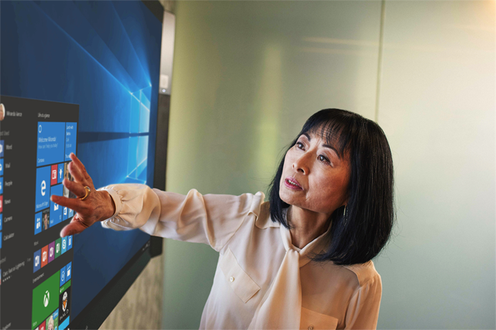
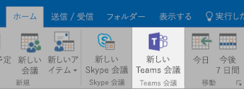
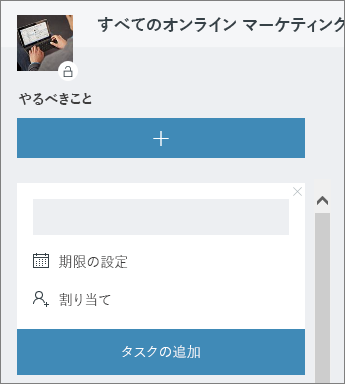

# Office の会議

午前 10 時。会議の時間です。 このセクションでは、会議の生産性を向上させる方法について説明します。  これには、会議の準備と Office 365 ツールに関するベスト プラクティスが含まれます。  

## ツール
- Outlook
- Microsoft Teams
- Skype for Business
- OneNote

## 会議のチェックリスト
- 会議を計画して予約する
- 会議に参加する
- 会議で情報を表示する
- 共同作成とメモのために会議で OneNote を使用する
- 会議で Planner を使用して、そのプロジェクトの実施項目を追跡する
- 会議を終了する
 
## 会議を計画して予約する
次のポイントを踏まえることで、会議の生産性を高めることができます。

1. **会議が必要な場合** まず、必要な承認者とチャットでファイルを共有することを検討します。  
1. **議題を明確にする。**  出席者が準備できるように、オンライン会議出席依頼の [メモ] セクションに会議の議題を含めます。
1. **会議を記録する。** 会議に出席できなかった人と会議を共有したり、後でメモを転記したりするために、Microsoft Teams の会議記録機能を使用します。  

これで、会議の予約をする準備ができました。Outlook で Microsoft Teams や Skype for Business の [詳細] を使用して、会議を予約します。 そうすることにより、さまざまな場所のチーム メンバーを含めることができ、会議を記録し、ビデオを活用して (可能な場合)、コミュニケーションを促進できます。 

## 会議に参加する
どこからでも参加できます。 Microsoft Teams や Skype for Business の会議には、モバイル デバイスを使って [会議の詳細] にあるダイヤルイン番号に電話するかモバイル アプリを使用することにより、どこからでも参加できます。 モバイル アプリを使用する場合は、お客様またはお住まいの国に適用されるモバイル データ使用量の制限にご注意ください。

> [!TIP]
> **ヘッドセットを使用する。** デスクのコンピューターから接続している場合は、コンピューターの内臓マイクやスピーカーを使う代わりにヘッドセットを使用すると、通話品質を改善できます。

> [!TIP]
> ビデオをオンにする。 カメラを使用できる場合は、カメラを使用しましょう。対面式のコミュニケーションでは、音声のみでは伝えきれない言葉以外のニュアンスを伝えることができます。 大丈夫。髪型も素敵ですよ。 

## 会議で情報を表示する
デバイスのコンテンツを共有することは、会議に集中させ、ディスカッションのコンテキストを提供する優れた方法の 1 つです。 一般的には、使用している画面全体を共有するのはよい方法とは言えません。 そのようにすると、自分の画面に表示されるものはすべて、会議に出席している他のユーザー全員の画面にも表示されてしまいます。 これは、Microsoft Teams で共有するコンテンツを選択するだけで避けることができます。 

## 会議で OneNote を使用する
OneNote は、リアルタイムのコラボレーションや共同作成を行えるので、会議でブレーンストーミングやメモ取りを行うのに最適なツールです。 OneNote が共有されている場所にすべてのユーザーがアクセスできさえすれば、そのノートブックのリンクを投稿するだけで、すぐにブレーンストーミングを始めることができます。

チーム ノートブックには、会議のメモ用に特定のセクションを作成できます。 OneNote の "会議の詳細" 機能を使用して、会議の詳細をまとめたページを作成することもできます。

## 会議で Planner を使用する
プロジェクトのプランに実施項目を直接追加することで、事後にそれらを転記する手間を省くことができます。 大規模なプロジェクト会議では、実施項目の追跡とメモ取りに誰かを割り当てておくことが最善です。 通常は、会議を進行している人物とは異なる人物を割り当てます。 実施項目の期限が過ぎると、その実施項目が割り当てられている人物にリマインダーが直接送信されます。 

## 会議を終了する
議題の議論がすべて済んだら、時間に関係なく会議を終了します。 すべての参加者に実施項目を割り当てて、送信します。 Microsoft Teams で共同作業を行っている場合は、適切なチャネルで実施項目を簡単に共有できます。 実施項目は、会議中に Planner で入力して割り当てることもできます。このようにすれば、完了をすばやく追跡でき、[Microsoft Teams でアクセスすることもできます](https://support.office.com/article/use-planner-in-microsoft-teams-62798a9f-e8f7-4722-a700-27dd28a06ee0)。 
