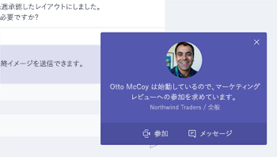

# Office での会議

10時 00分 AM と、会議の時間をお勧めします。このセクションでは、会議の生産性を向上させる方法を説明します。 これには、ミーティングの準備と Office 365 ツールのベスト プラクティスが含まれます。  

## ツール
- Outlook
- Microsoft Teams
- Skype for Business
- OneNote

## 会議のチェックリスト
- 予定し、会議を予約
- 会議に参加する
- 会議の情報を表示
- 会議で共同作成し、ノートの OneNote を使用してください。
- 会議でプランナーを使用して、そのプロジェクトの実施項目を追跡するために
- ミーティングを終了します。
 
## 予定し、会議を予約
可能な限りは、いくつかの点は、会議の生産性向上を確実に行うことができますがあります。

1. **会議が必要ですか?** 最初に必要な承認者とチャットでファイルを共有を検討してください。  
1. **明確なアジェンダがある**。 参加者が準備できるように、オンライン会議への招待の [メモ] セクションで、会議の議題が含まれます。
1. **ミーティングの記録** 会議出席できなかった人と共有する、またはノートを後で議事録を作成するのには、マイクロソフトのチームでミーティングのレコーディング機能を使用します。  

その会議を予約する準備ができましたので: マイクロソフトのチームでミーティングを予約またはビジネス用の Skype の詳細を Outlook にします。ので、これを使用すると、別の場所からのチーム メンバーが含まれて、ミーティングのレコーディングおよび通信を強化する (該当する場合)、ビデオを利用できます。 

## 会議に参加する
どこからでも参加できます。会議の詳細にダイヤルイン番号を呼び出すか、モバイル アプリケーションを使用して、モバイル デバイスを使用して任意の場所からビジネス会議のため、マイクロソフトのチームまたは Skype に参加することができます。モバイル アプリケーションを使用すると、場合は、モバイル データの使用制限、またはお住まいの国に適用されるのです。

> [!TIP]
> **ヘッドセットを使用します**。自分の席にお使いのコンピューターから接続する場合より良い通話品質を確保するのにはヘッドセットではなく、コンピューターの内蔵マイクとスピーカーを使用します。

> [!TIP]
> ビデオをオンにします。カメラが使用できる場合は、それらを使用する価値があるが無視される場合だけで音声を使用する場合の非言語的合図を提供する対面式の通信です。心配、髪の毛がすばらしい。 

## 会議の情報を表示
ミーティングに重点を置くし、ディスカッションにコンテキストを提供する優れた方法は、デバイスからコンテンツを共有します。一般に、画面全体を共有できる良い考えです。会議の参加者全員の画面で表示される画面上のすべてを意味します。マイクロソフトのチームで共有するコンテンツを選択するだけでこの問題を回避します。 

## 会議で OneNote を使用します。
OneNote では、リアルタイムのコラボレーションと共同作成の場合は、ブレーンストーミングの理想的なツールをすることと、会議に作成することに注意してください。OneNote の共有されている場所にアクセス権を持つすべてのユーザーとして、ノートブックへのリンクを投稿し、すぐにブレーンストーミングを開始できます。

チーム ノートブック内のノートを満たすための特定のセクションを作成することができます。会議の詳細の概要のページを作成するのには OneNote の [ミーティングの詳細] 機能を使用することもできます。

## プランナーを使用して、会議に参加
アクション アイテムをプロジェクトの計画に直接追加すると、事実の後に議事録の作成から保存します。アクションの & のメモを取ることを追跡する他のユーザーを割り当てるには大規模なプロジェクトの会議にすることをお勧めします。個人別の担当者は、通常この会議を実行します。アクション アイテムのアラームは、割り当てられるアイテムは、期限の日付を渡す場合は、アラームとして個別に直接送信されます。 

## ミーティングを終了します。
議題のすべてを説明すると、時間に関係なく、ミーティングを終了します。割り当てるし、アクション アイテムをすべての参加者に送信します。マイクロソフトのチームで共同作業するが場合、は、適切なチャネルでのアクション アイテムを簡単に共有できます。アクション アイテムも入力し、ミーティングでは、完了することができます[マイクロソフトのチームでアクセス](https://support.office.com/en-us/article/use-planner-in-microsoft-teams-62798a9f-e8f7-4722-a700-27dd28a06ee0)するを追跡するための高速な方法を提供するプランナーで割り当てられています。 