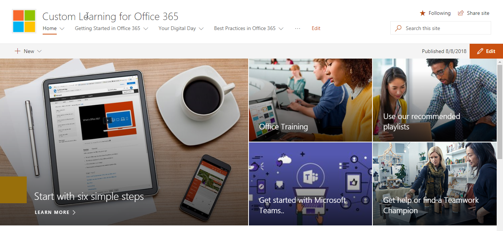
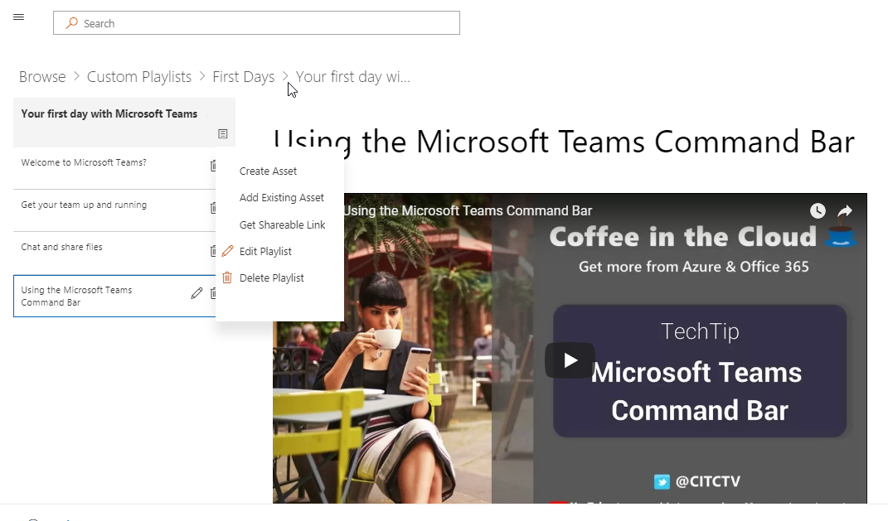

# カスタムの Office 365 の方法の学習Custom Learning for Office 365

## セルフ サービス、Microsoft からのカスタマイズ可能なトレーニング ・ ソリューションSelf service, customizable training solutions from Microsoft

カスタムの Office 365 の学習は、一連のトレーニングとオープン ソースのツールは、組織で Office 365 の使用量が増加するように設計された採用です。マイクロソフトのチーム、および SharePoint 製品のエンジニア リング グループと現代の支援と経験のチームとのパートナーシップの作成、これらの簡単に使用できるソリューション インストールして、SharePoint Online のテナントでカスタマイズします。Custom Learning for Office 365 is a set of training and adoption open source tools designed to increase usage of Office 365 in your organization. Created in partnership with Microsoft Teams and SharePoint Product Engineering groups and the Modern Assistance and Experience team, these simple-to-use solutions can be installed and customized in your SharePoint Online tenant. 

これらのソリューションは、すべてのトレーニング コンテンツ マイクロソフトが提供して、最新のコンテンツを必要に応じて、エンド ・ ユーザーにによりします。 サイトは、マイクロソフトのチームや社内の他の既存の SharePoint Online サイトのインストールを簡単に統合できます。These solutions bring to your end-users all the training content that Microsoft has to offer and keeps that content up to date on demand.  The site can easily be integrated with your installation of Microsoft Teams or other existing SharePoint Online sites in your company.

カスタム学習コンテンツは、現在 Office 365 製品用のコンテンツを開始するのにはスコープとなります。 含まれている複数のコンテンツを表示する場合は、承りますので[ご提案とフィードバック](feedback.md)、オンライン フォーラムで。Our custom learning content is currently scoped to beginning content for Office 365 products.  If you'd like to see more content included, give us [suggestions and feedback](feedback.md) in our online forum.  

## オープン ソース コンポーネントのカスタムの学習Custom Learning Open Source Components

カスタムの Office 365 の学習には、2 つのオプションが用意されています。Custom Learning for Office 365 provides two options: 

**オプション 1**:[カスタムの SharePoint Online サイト パッケージを学ぶ](installsitepackage.md)**Option 1**: [The Custom Learning SharePoint Online Site Package](installsitepackage.md)

選択してインストールし、会社のトレーニング ポータルを作成するのには、この SharePoint Online 通信サイト パッケージを構成します。チームワークの Toolkit と呼ばれていた、このトレーニングのポータルは、組織のヘルプ、サポート、およびコミュニティのコンテンツを追加するのにはカスタマイズできます。組織内でサポートしていないサービスに関連するあらゆるコンテンツを削除することもできます。カスタム サイト パッケージには、組織の Office 365 トレーニング コンテンツの最新のフィードを提供する学習のカスタム web パーツも含まれていますを学習します。Select, install, and configure this SharePoint Online communication site package to create a training portal for your company. Formerly known as Toolkit for Teamwork, this training portal can be customized to add your organization's help, support, and community content. You can also remove any content related to services not supported within your organization. The custom learning site package also includes the Custom Learning web part that provides an up-to-date feed of Office 365 training content to your organization. 

**オプション 2**: [Office 365 の web パーツのカスタム学習を](installwebpart.md)「カスタム ラーニング web パーツ オプションが組織で Office 365 のトレーニングを既存の SharePoint Online 通信サイトに統合するように設計されています。学習のカスタム web パーツは、任意の SharePoint Online のページにインストールすることができ、包括的な Support.Office.com、マイクロソフトのサイトから Office 365 のトレーニング コンテンツの最新のフィードを提供します。トレーニング、web パーツを通じて配信されるコンテンツは、再生リストの使用が簡単に構成されています。管理者は、トレーニングのカスタム再生リスト、YouTube のようにローカルにホストされているコンテンツからコンテンツを組み合わせることを構築するのに web パーツにも使用できます。Pdf、および Office 365 のトレーニング内容、組織のニーズに合わせたトレーニングの経験を提供します。**Option 2**: [The Custom Learning for Office 365 web part ](installwebpart.md) The Custom Learning web part option is designed for organizations that want to integrate Office 365 training into an existing SharePoint Online communication site. The Custom Learning web part can be installed on any SharePoint Online page and provides an up-to-date feed of the full suite of Office 365 training content from Microsoft's Support.Office.com site. Training content delivered through the web part is organized in easy-to-consume playlists. Administrators can also use the web part to build custom training playlists, combining content from YouTube, locally hosted content like .PDFs, and Office 365 training content, to provide training experiences tailored to the unique needs of the organization.

## 4 つの簡単な手順4 Easy Steps

[はじめ](getstarted.md)に最新の Microsoft との単純なトレーニング ソリューションを作成するコンテンツを使用できます。Lets [get started](getstarted.md) creating a simple training solutions with up to date Microsoft content.

1. ソリューションの右側を選択します。Select the solution right for you
2. 完全なインストール & は、コンテンツをカスタマイズする、Complete your installation & customize your content
3. [導入ツール](driveadoption.md)を使用して、ユーザーとサイトを共有します。Share your site with your users using our [adoption tools](driveadoption.md)
