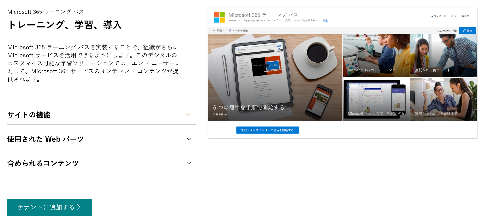

# Microsoft 365 学習経路 
Microsoft 365 ラーニング パスは、組織内での Microsoft 365 サービスの使用と導入を増やす目的で設計された、カスタマイズ可能なオンデマンド学習ソリューションです。    

> [!IMPORTANT]
> 学習経路は、四半期ごとにコンテンツ更新サイクルに従う努力をしています。 2021 年 3 月 1 日現在、3 月のコンテンツ更新プログラムの学習経路コンテンツが更新されました。 3 月のコンテンツ更新プログラムの詳細については、「コンテンツ更新プログラム」 [を参照してください](custom_contentupdates.md)。 コンテンツ更新プログラムの適用方法とコンテンツの管理方法については、「コンテンツ更新プログラムの管理 [」を参照してください](custom_contentupdatesmanage.md)。  

## Microsoft からのオンデマンドのカスタム トレーニング

Microsoft 365 ラーニング パスでは、次のサービスを提供しています。

- **完全にカスタマイズ可能な SharePoint Online** コミュニケーション サイト - ラーニング パストレーニング ポータルをカスタマイズして、組織のヘルプ、サポート、コミュニティ コンテンツを追加できます
- **簡単なプロビジョニング** - 簡単な手順で SharePoint Online プロビジョニング サービスから学習経路をプロビジョニングする
- **独自のトレーニングプレイリスト** を作成する機能 - 学習経路を使用して、環境の固有のニーズを満たすターゲットトレーニングプレイリストを作成できます
- **最新のコンテンツ** - ラーニング パスは Microsoft オンライン コンテンツ カタログを通じてコンテンツを提供し、サイトのコンテンツは定期的に更新されます。

> [!VIDEO https://www.microsoft.com/videoplayer/embed/RE42hMy]

## SharePoint ルック ブック サービス
学習経路は、SharePoint のルック ブック サービスからプロビジョニングできます。 Microsoft 365 ラーニング パスを準備すると、組織は、トレーニング コンテンツのオンライン カタログに接続された学習経路 Web パーツと共に、箱から出たトレーニング ポータルとして設計された SharePoint Online コミュニケーション サイトを取得します。 

## 4 つの簡単な手順
環境に合った学習経路エクスペリエンスの作成を始めましょう。
1. 「ラーニング パス [の多言語サポートの概要」を参照してください](custom_overview_ml.md)。 
2. セットアップ オプション [を選択し](custom_setupoptions.md) 、Microsoft 365 ラーニング パスを準備します。  
3. 環境に合わせて学習経路を調整します。
4. 導入ツールを使用して、ユーザーと学習経路 [を共有します](driveadoption.md)。

## フィードバックとサポート

Microsoft 365 ラーニング パスは、GitHub のオンラインの問題一覧でサポートされるオープン [ソース](https://aka.ms/CustomLearningHelp) プロジェクトです。 ラーニング パス ソリューションとコンポーネントは、既存の Microsoft サポート契約の対象ではありません。  

## その他のリソース
Microsoft 365 ラーニング パス サイトを使用して、新規または既存のユーザー コミュニティ フォーラムへのリンクを提供できます。 内部ユーザー グループが存在しない場合は、ユーザーが成功を共有し、お互いから学ぶことを可能にするために、内部ユーザー グループを開始してください。  内部ユーザー グループを育てる時間が無い場合は、Microsoft Office [365 チャンピオン](https://aka.ms/O365Champions) コミュニティに参加して、毎月のトレーニング、オンライン コミュニティへのメンバーシップ、Office 365 のツールとリソースへの早期アクセスを行えます。