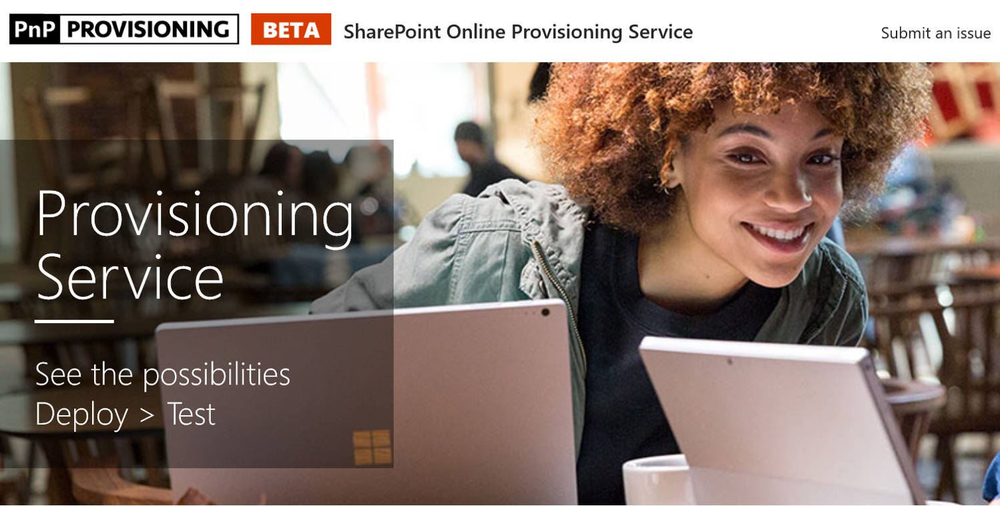

# 学習サイトのユーザー設定を準備します。

1. http://provisioning.sharepointpnp.comのインストールを使用して、対象となるテナントのユーザーの資格情報を使用してサインインを計画します。
1. 組織のための同意を確認し、同意を選択します。
1. ソリューション ギャラリーから Office 365 のユーザー設定の学習を選択します。 
1. テナントに追加する] を選択 
1. テナント環境に CLO365 をインストールする準備ができたら、必要な選択の準備として、[準備] ページで、既定の選択内容を調整します。  
1. プロビジョニング プロセスは、最大 15 分かかります。(提供ページで入力した通知の電子メール アドレス) にメールで通知されますと、サイトは、アクセスの準備が完了します。 
1. 1 回にログオンして CLO365、テナントは、お気に入りのサイトや、将来の参照用の url をコピーします。  

## 次のステップ
- Web パーツに含まれる[既定のコンテンツ](sitecontent.md)を表示します。
- [ユーザー設定](customization.md)、組織のトレーニング経験します。
- トレーニング ソリューションの[採用を推進](driveadoption.md)をします。

