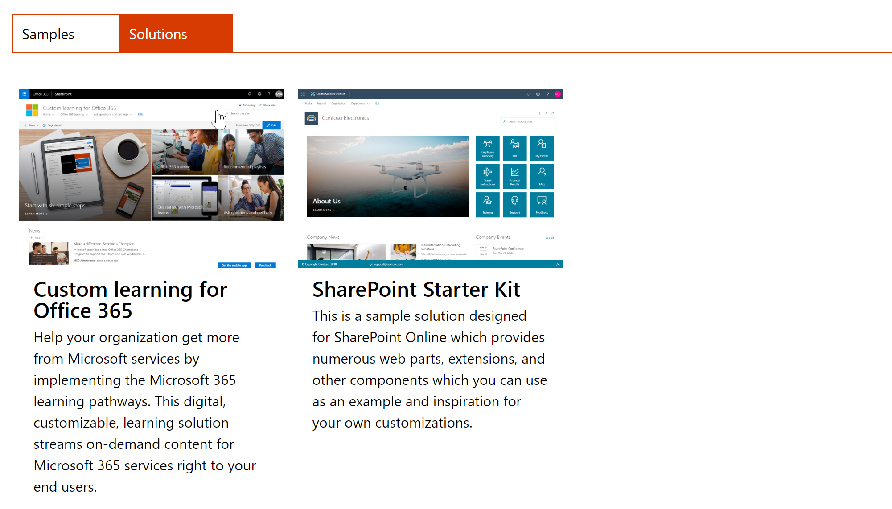

# カスタム学習サイトをプロビジョニングする

1. にhttp://provisioning.sharepointpnp.com移動して、ホームページの右上隅から**サインイン**します。 サイトテンプレートをインストールする予定の対象となるテナントの資格情報を使用してサインインします。

2. **組織の代わりに同意**をクリアし、[**同意**する] を選択します。

3. ソリューションギャラリーから [ **Office 365 のカスタム学習**] を選択します。

4. ソリューションのホームページで、[**テナントに追加する**] を選択します。

5. ご使用のインストールに応じて、[プロビジョニング情報] ページのフィールドを入力します。少なくとも、プロビジョニングプロセスに関する通知を取得する電子メールアドレスと、サイトをプロビジョニングする宛先の URL を入力します。  

> [!NOTE]
> サイトの宛先 URL を、"/sites/MyTraining" や "/teams/LearnOffice365" などの従業員にとってわかりやすいものにします。

6. テナント**** 環境に CLO365 をインストールする準備ができたら、[準備] を選択します。 プロビジョニングプロセスには最大15分かかります。サイトがアクセスできる状態になると、メールによって ([プロビジョニング] ページで入力した通知の電子メールアドレスに) 通知されます。

7. 準備が完了したことが通知されたら、[プロビジョニング] ページで入力した宛先 URL を参照します。

8. 右上隅にサイトをお気に入りに置いて、後で参照するために URL をブックマークにします。  

### 次のステップ
- webpart に含まれる[既定のコンテンツ](sitecontent.md)について説明します。
- 組織のトレーニング環境を[カスタマイズ](customization.md)します。
- トレーニングソリューションの[導入を促進](driveadoption.md)します。
