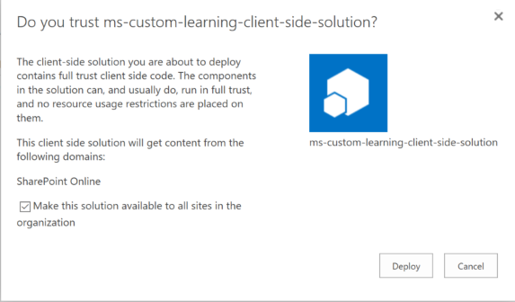
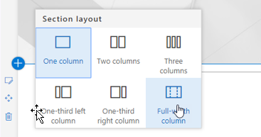
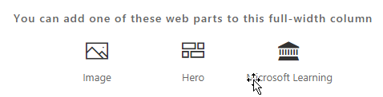

# カスタム学習ソリューション web パーツのインストール

## テナント全体へのインストールの前提条件

- テナント全体にカスタム学習 web パーツをインストールするには、Office 365 の管理アクセス許可を持っている必要があります。 これらのアクセス許可がない場合は、Office 365 管理者と連携するか、または個々のサイトコレクションの web パーツをインストールすることができます。
- ユーザーまたは Office 365 管理者は、web パーツを受信するために、テナント全体の[アプリカタログ](https://docs.microsoft.com/en-us/sharepoint/dev/spfx/set-up-your-developer-tenant)または[サイトコレクションのアプリカタログ](https://docs.microsoft.com/en-us/sharepoint/dev/general-development/site-collection-app-catalog)をセットアップして構成する必要があります。
- SharePoint Online のみをサポートしています。web パーツは、オンプレミスの SharePoint の任意のバージョンへのインストールをサポートしていません。

## テナントにカスタム学習 web パーツを追加する 

1. カスタム学習 web パーツをダウンロードして、ローカルドライブに保存します。 このファイルの名前は "ms-カスタム-learning. sppkg" です。 ファイルの名前やサフィックスを変更しないでください。 
2. テナントの[Office 365 管理ポータル](https://admin.microsoft.com/AdminPortal/Home#/homepage)に移動します。
3. 左側のナビゲーションで、[管理センター]、[SharePoint] のどちらかを選択します。これは、新しいタブに表示されます。の sharepoint 管理センターで、[アプリ]、[アプリカタログ]、[sharepoint 用アプリ] の順番でクリックします。 
4. [web パーツのアップロード] を選択し、ダウンロードした「ms (カスタム-learning) ファイル」を選択します。
5. このテナント全体のインストールの場合は、[組織内のすべてのソリューションでこのソリューションを使用できるようにする] の横にあるチェックボックスをオンにします。  
 
> [!NOTE]
> web パーツがインストールされると、SharePoint Online の webpart ギャラリーに表示されます。 **ギャラリー内の webpart には、「Microsoft Learning」という名前が付けられます**。

## Microsoft Learning webpart を SharePoint Online ページに追加する

テナントにカスタム学習をインストールした後、Web パーツを SharePoint ページに追加することができます。Office 365 を実行すると、サイトで Windows 10 のトレーニングを利用できるようになります。

1. [全幅] 列レイアウトにカスタム学習 web パーツを追加します。

2. SharePoint ページで、[セクションの追加] を選択し、[全角列] を選択します。 次のプロンプトが表示されます。

3. [Microsoft Learning] を選択します。 次のように表示されます。 

 タイルをクリックして、ソリューションに含まれる既定のコンテンツを調べることができるようになります。  

### 次のステップ
- webpart に含まれる[既定のコンテンツ](webpartcontent.md)について説明します。
- 組織のトレーニング環境を[カスタマイズ](customization.md)します。
- トレーニングソリューションの[導入を促進](driveadoption.md)します。

