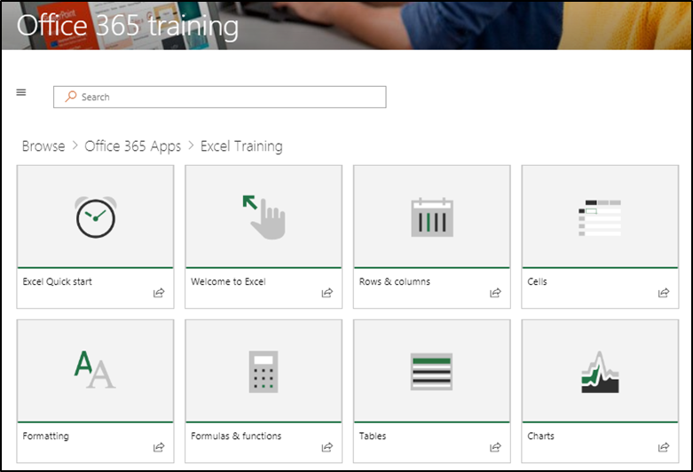
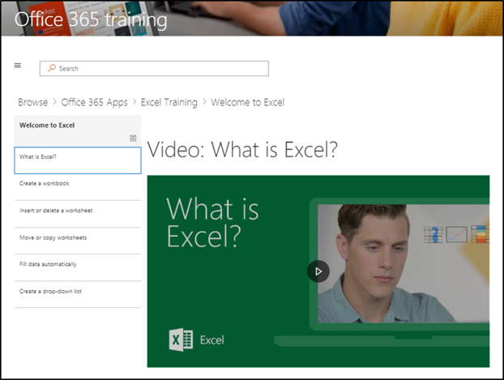

# サイトと既定のコンテンツを参照するExplore the site and default content

### サイトのツアーTour the site 

ホームページに移動し、[Office 365 トレーニング] を選択します。SharePoint Online サイトの各ページは、Microsoft Learning web パーツをホストするように構成されています。これにより、web パーツ内で使用可能なすべてのコンテンツをページに表示できるようになります。Navigate to the Home page and select Office 365 Training. EAch page in the SharePoint Online site is configured to host the Microsoft Learning webpart. This enables the page to  display all the content available within the webpart.

メニューバーで、ナビゲーションアイテム**Office 365 のトレーニング**を選択し、[ **OneDrive での作業の開始**] を選択します。この場合、Web パーツはコンテンツをフィルター処理して、OneDrive のコンテンツのみを表示します。From the menu bar, select the navigation item **Office 365 Training** and then select **Get Started with OneDrive**. In this case, the Web part filters the content to show only OneDrive content.

他の2つのメニューオプションに対して上記の手順を繰り返し、 **Teams の使用を開始**し、 **SharePoint Online を使用**してコンテンツを確認し、ナビゲーションをテストします。Repeat these steps for the other two menu options, **Get Started with Teams** and **Get Started with SharePoint Online** to review their content and test the navigation.

ホームページに戻り、 **6 つの簡単な手順で開始**するを選択します。これにより、6つのシンプルなステップの再生リストに移動できます。Navigate back to the Home page and select **Start with Six Simple Steps**. This takes you to the Six Simple Steps playlist.

> [!TIP]
> 6つの簡単な手順は、Microsoft research チームから派生しています。これらの手順は、Microsoft の研究者が最も普及していることを示しています。つまり、ユーザーがこれらの手順を実行すると、Office 365 の使用が増加し、生産性の高いワーカーになることがわかります。これは、すべての人にとって適しています。The Six Simple Steps are derived from a Microsoft research team. These are the steps that Microsoft researchers have found to be the most sticky, meaning if users go through these steps, their use of Office 365 will increase and they will become more productive workers. And that’s good for everybody.

### 6つの簡単な手順で開始ページに移動します。Go to Start with Six Simple Steps
- ホームページで、[6 つの簡単な手順で開始] をクリックします。From the Home page, click Start with six simple steps. 
- カスタム学習 web パーツがある Office トレーニングページが表示され、6つのシンプルな手順の再生リストから始めにルーティングされます。You see the Office Training page with the Custom Learning web part routed to the Start with six simple steps playlist.  

### カテゴリの再生リストを表示するView a list of playlists for a category

Office 365 トレーニングページから、excel トレーニングを選択して、excel トレーニングプレイリストに移動します。From the Office 365 training page select Excel Training to go to a list of Excel Training playlists.

### 再生リストを表示するView a Playlist

[ **Excel へようこそ**] をクリックして再生リストを表示するClick **Welcome to Excel** to view the playlist

これで、各ページに表示されている正しいコンテンツがサイトに設定されました。Your site is now set up with the correct content being displayed on each page. 

## 次のステップNext Steps
- [サイトコンテンツをカスタマイズするCustomize site content](customization.md)
- [ドライブ導入Drive adoption](driveadoption.md) 
