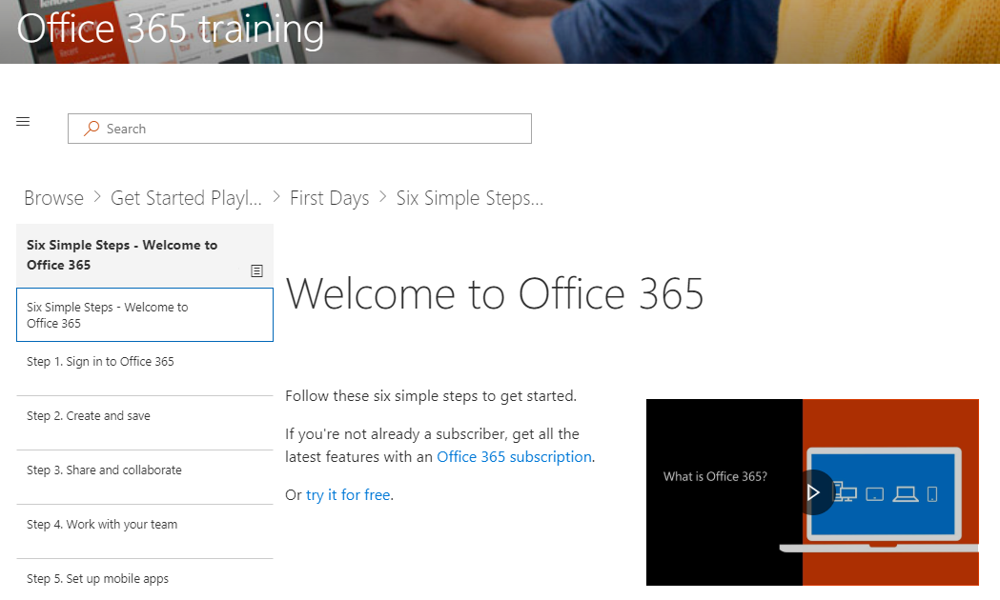

# トレーニングの web パーツとサイトのコンテンツ

このソリューション セットで提供するコンテンツを確認してみましょう。 直接ストリーミング コンテンツの web パーツでは、まず 

6 つの簡単な手順は、マイクロソフトの研究チームから派生します。次のとおりのマイクロソフトの研究者が最も押しにくい場合、ユーザーは、この手順は、Office 365 の使用が増加し、作業者の生産性の向上になるです。全員のことをお勧めします。

頭に六つの移動の簡単な手順
- ホーム ページでは、六つの簡単な手順で [開始] をクリックします。 
- 六つの簡単な手順の再生リストの先頭にルーティングされるカスタム ラーニングの web パーツで、Office のトレーニング ページを参照してください。  

