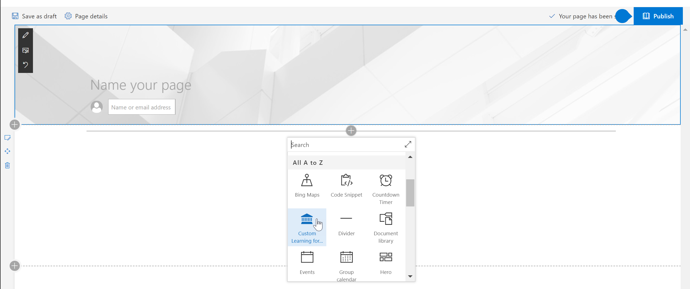
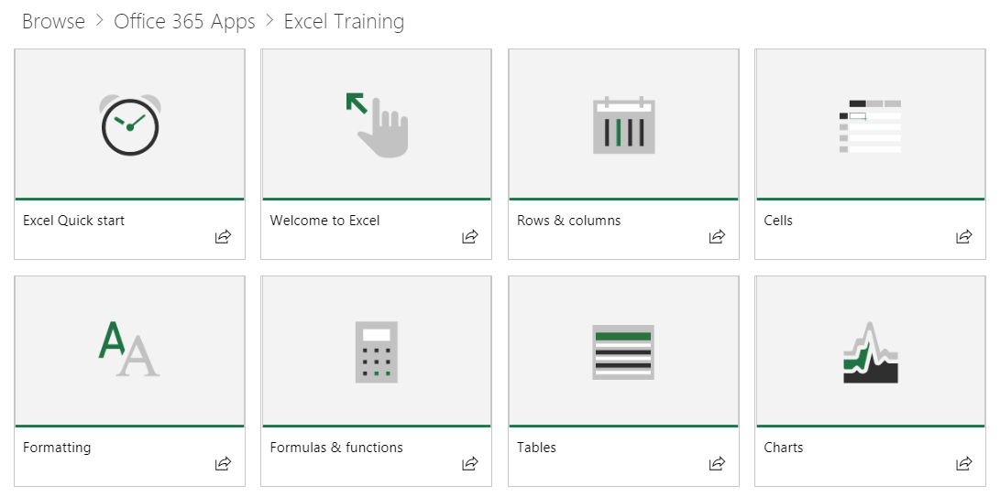
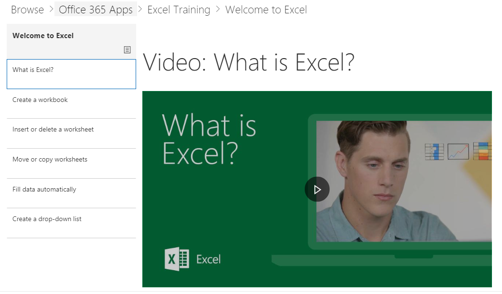

# Web パーツの既定のコンテンツ

## 再生リスト モデル

当社の web パーツは、コンテンツを整理するために再生リストの一般的なモデルを使用します。 このモデルは、エンド ・ ユーザーを理解するための単純なとをカスタマイズする必要があるができます。 カスタマイズが必要ではありません。 ボックス エクスペリエンスの出力は、広範な調査に基づく効果的なトレーニング コンテンツを提供します。

これらの再生リストは、ユーザーの学習経験を調整および指導を行うこと、新しいより生産性の高い動作の消費を簡単に再生リストを表示するために設計されています。Support.Office.com のコンテンツは、サービスを提供し、資産は、簡潔、peppy、魅力的なビデオでは。 

各タイルは、個々 の主要な再生リストまたはコンテンツのカテゴリのいずれかを表します。クリックすると、再生リストまたはカテゴリのタイルを簡単に選択した領域にユーザーを移動します。次の図は、Excel、Microsoft のチーム、およびその他のユーザーと同じように「取得の開始の再生リスト」と Office 365 アプリケーションのカテゴリの下の両方の主要なリストを示しています。 

Excel のカテゴリをクリックするとインスタンスの移動して再生リストのコレクションにします。 順序内のコンテンツを視聴したり、学習ニーズに基づいてどのような興味を選択する、ことができます。 

再生リストのビューを選択します。

## 次のステップ

- 参照し、既存のコンテンツをお読みください。
- [再生リストをカスタマイズするの](customplaylists.md)に進みます